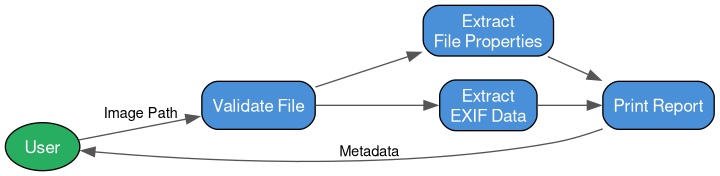

# Lab 1 — Image Analyzer

Reads an image file and extracts metadata including file properties (size, format, dimensions) and EXIF data (camera, date, orientation).

## Supported Formats
- JPG / JPEG, PNG, TIFF, WEBP, BMP

## Usage
```bash
python image_analyzer.py <path_to_image>
```

## Requirements
```
pip install Pillow
```

## Sample File Used


## Workflow



## Sample Output
```
================================
IMAGE METADATA REPORT
================================
File Name       : sample.jpg
File Size       : 273.05 KB
File Format     : JPEG
Width           : 1600 px
Height          : 1598 px
Resolution      : (72, 72)
Color Mode      : RGB

EXIF Metadata
-------------------------------
Software        : Adobe Photoshop CS4 Windows
Orientation     : 1
Date Taken      : 2009:01:31 22:25:45
```
