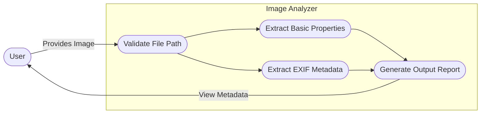

# Lab 1: Image Analyzer

This script reads an image file and extracts metadata, including standard file properties (size, format, dimensions) and EXIF data (camera make/model, date taken, orientation, etc.) if available.

## Supported Formats
- Minimum: JPG/JPEG, PNG
- Bonus: TIFF, WEBP, BMP

## Usage
```bash
python image_analyzer.py <path_to_image>
```

## Requirements
- Python 3
- Pillow (`pip install Pillow`)

## System Workflow / Use Case

